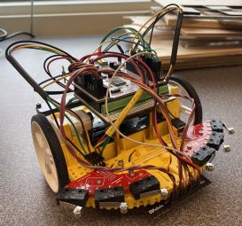

# **ME 405 Romi Term Project Portfolio**
This repository outlines our Romi term project that was completed by Roy Cabrera and Jandre Lafradez during the Winter 2025 Quarter at Cal Poly, San Luis Obispo. Code files are attached above, with explanations of each file to follow later within this section. Hardware components are also attached with their links for anyone interested in recreating their own Romi project.   
  

## **Table of Contents**
1) [Required Materials](#required-materials)  
2) [Romi Assembly](#romi-assembly)  
3) [Wiring Diagram](#wiring-diagram)  
4) [State Transition Diagram](#state-transition-diagram)  
5) [Finite State Machines](#finite-state-machines)  
6) [Explanations of each class](#explanations-of-each-class)  
  a)  
  b)  
  c)

## **Required Materials**  
| Qty | Part Name |  
|----|------------------|  
|6|M2.5x8mm Standoff|  
|8|M2.5x10mm Standoff|
|4|M2.5x30mm Standoff|
|4|M2.5x6mm Socket Head Cap Screw|
|4|M2.5x8mm Socket Head Cap Screw|
|4|M2.5x10mm Socket Head Cap Screw|
|8|M2.5 Nylon Lock Nuts|
|8|M2.5 Nylon Washer|
|1|Acrylic Romi-to-Shoe Adapter|
|1|BNO055 IMU Breakout Board|
|1|Modified Shoe of Brian|
|1|Nucleo L476RG|
|1|Romi Chassis w/ Wheels and Casters|
|1|120pc Dupont Ribbon|
|1|HC-05 Bluetooth Module|
|6|AA Batteries|
|1|IR Reflectance Sensor|
|1|Bump Sensor Kit|

## **Romi Assembly**
## **Wiring Diagram**
## **State Transition Diagram**
### **Motor Class**
### **IR Sensor Class**
## **Finite State Machines**
## **Explanations of each class**

