# **ME 405 Romi Term Project Portfolio**
This repository outlines our Romi term project that was completed by Roy Cabrera and Jandre Lafradez during the Winter 2025 Quarter at Cal Poly, San Luis Obispo. Code files are attached above, with explanations of each file to follow later within this section. Hardware components are also attached with their links for anyone interested in recreating their own Romi project.   
  

## **Table of Contents**
1) [Required Materials](#required-materials)  
2) [Romi Assembly](#romi-assembly)  
3) [Wiring Diagram](#wiring-diagram)  
4) [State Transition Diagram & Shared Variables](#state-transition-diagram)  
5) [Finite State Machines](#finite-state-machines)  
6) [Explanations of each py file](#explanations-of-each-py-file)  
  a) [motor.py](#motor-py)    
  b) [Encoder.py](#encoder-py)    
  c) [cotask.py](#cotask-py)  
  d) [task_share.py](#task_share-py)  
  e) [linesensor.py](#linesensor-py)  
  f) [main.py](#main-py)
7) [Game Track and Results](#game-track-and-results)

## **Required Materials**  
| Qty | Part Name |  
|----|------------------|  
|6|[M2.5x8mm Standoff](https://www.amazon.com/HELIFOUNER-Standoffs-Assortment-Threaded-Motherboard/dp/B0B7SNCFF1/ref=sr_1_1_sspa?crid=39OOL49HOZYYP&dib=eyJ2IjoiMSJ9.R1Y_pSmTsEnF_05yeQt1b1YjhKCs4NhWuFRgfXSsDssx-KmbAemXNTopqg4CKNWrmaA8Pmw2e66j5ImR7Gt_fbRGj9pkZPNdl-IHEEpk43dNwjfptE6TDrp-QfjS8Xcba_eb-2qHPMGShj-8W_WtNERCt2DZxnnTG3PQlH01jAO3FVd8RTZKCcbuMoO5glIGVDWpPZngLRrsE5BHLZlRekkx_u90gSv7gjzTS6ieVDyX5zJbnl660Qb16T9KO3iPwvxvXNYG70tcPl-i2T7G83VI1eNPsVo8y6cOGovxvEg.FfXshduiA5rxLbjgs7EEgRl-YFgDpzXczNs5eAmqFOs&dib_tag=se&keywords=m2.5%2Bstandoffs&qid=1741826716&s=industrial&sprefix=m2.5%2Bstandoffds%2Cindustrial%2C193&sr=1-1-spons&sp_csd=d2lkZ2V0TmFtZT1zcF9hdGY&th=1)|  
|8|M2.5x10mm Standoff|
|4|M2.5x30mm Standoff|
|4|[M2.5x6mm Socket Head Cap Screw](https://www.amazon.com/Pieces-Washers-Sutemribor-Assortment-Threaded/dp/B0CXQ4QTGT/ref=sr_1_1_sspa?crid=35K93HSFV9742&dib=eyJ2IjoiMSJ9.oNdkffsvE5kZ1Y7M7vl0Zy5KpEbfg83e__Bac_QSh3wlPoA0gKf3QLy2TaosdxQFixN_OTaaGohJ7jObLJ57jtrxzWN1mZAV73Dz29BIU25LjqyvqXEiZofI0wh3YU3IlCOFAR2BjP_eiuDgeH6a-MwDvSTalHfSpvzw-0io4rLKqGoJwMPz2v1xGlV8dYl84R6guQFgVDev_Yp-o9kY9UwBmKGqBS3sgqFb9IrZVBo.GjWp1EXV3KZLIBNgqLPnsou2wgunYguo-pKMavuUyMc&dib_tag=se&keywords=M2.5%2BSocket%2BHead%2BCap%2BScrew&qid=1741827025&sprefix=m2.5%2Bsocket%2Bhead%2Bcap%2Bscrew%2Caps%2C184&sr=8-1-spons&sp_csd=d2lkZ2V0TmFtZT1zcF9hdGY&th=1)|
|4|M2.5x8mm Socket Head Cap Screw|
|4|M2.5x10mm Socket Head Cap Screw|
|8|[M2.5 Nylon Lock Nuts](https://www.amazon.com/binifiMux-100pcs-0-45mm-Stainless-Locking/dp/B07LC4LZB6/ref=sr_1_4?crid=2O4MVOP42T7G3&dib=eyJ2IjoiMSJ9.0MhNLCmDLtUikKjKopiJRs738OPapNh77Zm5Beqzhut7BqvPIgnKpMlyyooo-1ahel137SIX3B8PHkdSuBINWilSLMfyljooj77Nji2SKdvAhJCpV_NiiQSUo5hsSGY2qgvlA0o3T0-vGbDKYaBOSA5gTKSO8iXuWNlx_YzuiRi2m0ygL75-EZ_gMYZzZ7RuRvuo3-SblD1EWIwm3ngKQVFU3sTaFX5oFWAFOGP3GyNtgx2bQ8jFIyH8yk9856x1-Kj-n1JAsJzPkGSxanJPdiIXvKPUcER9Fsf3Cm4lyjiRHPxwgy212WCnm3vVU4ORVW4iH_Y6kumA4-Do4P7ZXr2cTdGqiI6sa-D4joyjCQU.exCEzy71gPITLcO9G4eUsAqVDnKylt4Z2GRT2uAKVuk&dib_tag=se&keywords=M2.5+Nylon+Lock+Nuts&qid=1741827096&s=industrial&sprefix=m2.5+nylon+lock+nuts%2Cindustrial%2C224&sr=1-4)|
|8|[M2.5 Nylon Washer](https://www.amazon.com/uxcell-Washers-Thickness-Sealing-Gasket/dp/B014UB5TNM/ref=sr_1_4?crid=17DUM5FLADKEZ&dib=eyJ2IjoiMSJ9.JY2TmpQ3L0ybLY3dqW-BQesQMPyz-J9ngdf-ohiZwlDVkpvHWTMmyD6Pfs_gJ-xnUYR0DCxPdGy30ommgFn6wjO4gRtunFqe5YluoxM6VkxZNdXumCQGy-2_Hj3FZhq0jjQHBF8_-MMG2IuLEVwDuXINLXbMd60gaey3EFymNUc6pDtGmkkhva5y3_7q5iNa7B0etqiB9c9htWzz7HzQd6BGJSRsxxDYbTN4H7P8SnY.FoLVg3QeswNZ39HxPLTqCkwhgqn9q32jnHgwzZ2gRGU&dib_tag=se&keywords=M2.5%2BNylon%2BWasher&qid=1741827139&sprefix=m2.5%2Bnylon%2Bwasher%2Caps%2C542&sr=8-4&th=1)|
|1|Acrylic Romi-to-Shoe Adapter|
|1|[BNO055 IMU Breakout Board](https://www.adafruit.com/product/2472)|
|1|Modified Shoe of Brian|
|1|[Nucleo L476RG](https://www.amazon.com/STM32-Nucleo-64-Development-STM32L476RG-NUCLEO-L476RG/dp/B01IO3N646/ref=asc_df_B01IO3N646?tag=bingshoppinga-20&linkCode=df0&hvadid=80883013965175&hvnetw=o&hvqmt=e&hvbmt=be&hvdev=c&hvlocint=&hvlocphy=&hvtargid=pla-4584482478710114&psc=1&msclkid=a6354354cadc109814112486e7d457d3)|
|1|[Romi Chassis w/ Wheels and Casters](https://www.pololu.com/product/3504)|
|1|[120pc Dupont Ribbon](https://www.amazon.com/dp/B07GCY6CH7)|
|1|[HC-05 Bluetooth Module](https://www.amazon.com/dp/B01MQKX7VP)|
|6|[AA Batteries](https://www.amazon.com/Coppertop-Batteries-Ingredients-Long-lasting-Household/dp/B000IZQO7U/ref=sr_1_4?crid=2MKA0OT2RUVJ7&dib=eyJ2IjoiMSJ9.bVDHrtnE9UWilTlB-nv1XPqOW_2BDVUEJAEK28lWbTsdTqoyTHxxgvU2pJfok-iawYULS5jA0PsM3LiJf2k5toI8T3nylWQ0GcF1FwP6UFHAIjcf6IWfo-o9-4UdXACN0uj_EDWWLjvZZIcb4k9j4oc9OI66DgNum_-Zirt7SdAZdHwLQ5t5ptK6yQGAtRZDopWlr3K4bCMdFV384hIa9jnvSta-uN9jGt0XWvpKpWFME-BB8SCvPdJGvU5mMCFwLHuUyZVZbDneiJ89elfZO6uwIyVUXlCR3tbiwzSBK9STK_Bfb3Wcs-Xyv-VesiaPQISaw5JfYNjWXMZKh6NQ0ZjCAdRHnbtCqt6Ae-QgWgs.p4gI1OKLANbg2qd9lzlz36GsgeNm0M0NGe2qoGeBEmo&dib_tag=se&keywords=aa+batteries+pack+of+6&qid=1741827500&rdc=1&s=electronics&sprefix=aa+batteries+pack+of+%2Celectronics%2C173&sr=1-4)|
|1|[IR Reflectance Sensor](https://www.pololu.com/product/4248)|
|1|[Left Bump Sensor](https://www.pololu.com/product/3673)|
|1|[Right Bump Sensor](https://www.pololu.com/product/3674)|
|1|[USB-Mini-B to USB-C Cable](https://www.amazon.com/dp/B08GG47H8T?th=1)|

## **Romi Assembly**
**Initial Steps**  
To learn how to connect and wire the Shoe of Brian, nucleo, encoders, motors, and IMU, please refer to the attached [Romi Assembly](RomiAssembly.pdf) file that was handed to us during lab by our professor, Charlie Refvem. Please refer to the [Wiring Diagram](#wiring-diagram) for wiring guidelines. 

**Attaching the IR Sensor**  
For our IR sensor, we selected the 8-channel, 8-pitch option, as it provided sufficient coverage for our path width and featured an analog output. To attach the sensor to our Romi, we first soldered headers to create connection points for our wiring. We then secured the sensor to the front middle portion of the robot using two M2.5x8 standoffs, two M2.5x8mm head screws, and two M2.5 nylon washers. Ground and voltage were wired to our Nucleo. To maximize sensor utilization while minimizing wiring complexity, we connected channels 1, 3, 5, 7, 9, 11, 13, and 15. As previously mentioned, please refer to the [Wiring Diagram](#wiring-diagram) for wiring guidelines. 

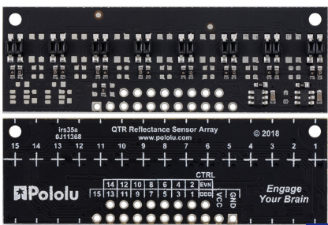 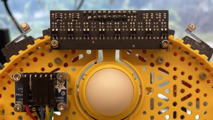 

**Attaching the Bump Sensor**  
Mounting the bump sensors proved challenging due to interference from the IR sensor and IMU, which were already positioned on the robot. Initially, the limited space made it difficult to secure the sensors without obstructing other components. To resolve this, we used four M2.5x10mm standoffs and screws to elevate the bump sensors, ensuring they were properly mounted without interfering with the IR sensor or IMU. This adjustment allowed for a secure fit while maintaining the functionality of all components. Once mounted, we then wired ground and the remaining bumper pins. Once again, please refer to the [Wiring Diagram](#wiring-diagram) for wiring guidelines.  

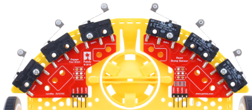 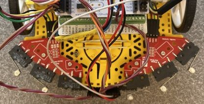 

## **Wiring Diagram**  
The following wiring diagram shows how we were able to wire our power, bump sensors, IR sensor, IMU, encoders, and motors to our Nucleo L476RG. Please note that for ease of view, each connected part has its own respective color. However, ground and power remain black and red for each part it applies to.  

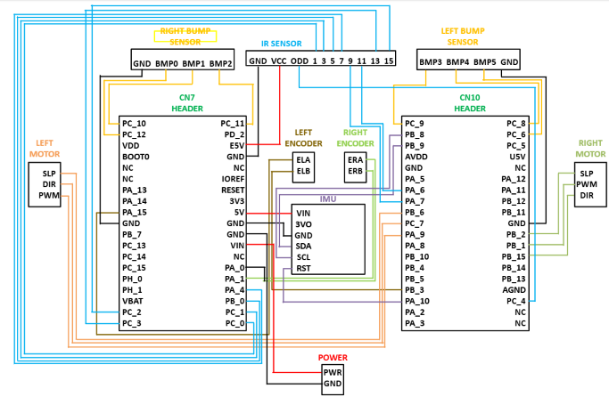
## **State Transition Diagram**

### **Shared Variables**
| Variable | Data Stored |Purpose|  
|----|------------------|----------------|  
|eff_L|effort of left motor|sets the effort to the left motor based off error feedback|
|eff_R|effort of right motor|sets the effort to the right motor based off error feedback|
|test_state|Boolean value of 0,1, or 2|tells system what state it is on|
|pos_L|current position of the left wheel|value is added to data array|
|pos_R|current position of the right wheel|value is added to data array|
|vel_L|current velocity of the left wheel|value is added to data array|
|vel_R|current velocity of the right wheel|value is added to data array|
|heading_share|current heading reading of IMU|value is added to data array|
|initial_heading_share|initial heading at the starting line|used to compare the 180 degree heading difference at Checkpoint 4 (beginning portion of the grid|

## **Finite State Machines**
### *motor_task*  
The motor task bounces around 2 states. When Romi is in test state 1 or 2, it is running; however, it is in idle mode when test state is 0.  
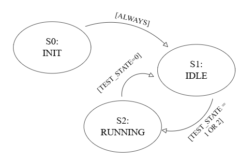

### *user_task*  
The user task is what allows Romi to know whether to run or not. When the user presses 1 on the keyboard, Romi enters test state 1 and starts its run.  
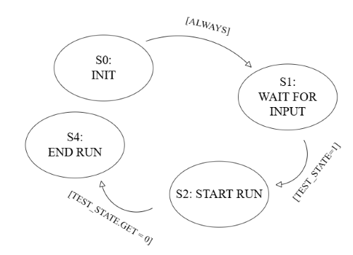

### *sensor_task*  
We have decided to include two FSM's for our IR sensor task: one for what's happening within the *linesensor.py* file when the centroid is being created and another for what's happening in the main code.  

In order to successfully achieve PID control, each of our 8 outputs on our sensor collect readings based off light reflectivity (high for black and low for white). From this, a centroid is collected and errors are computed based off inline Romi is with the path. From there, the motor efforts for each wheel and then corrected to account for these errors.  

Since we were unable to successfully continue through the diamond path with just IR sensing (this will be discussed more in the [Game Track and Results](#game-track-and-results) ) section, we hardcoded some values that allowed or Romi to manually drive forward during the duration of 30-37 left encoder position ticks. If our position is out of this range, Romi will continue to use line following based off the IR sensor.  
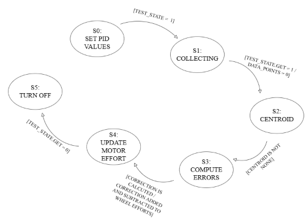
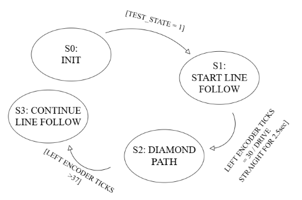

### *encoder_task*

The encoder task allows us to collect position, velocity, and acceleration when Romi is running. Once Romi is turned off, our data values are reset back to 0.  
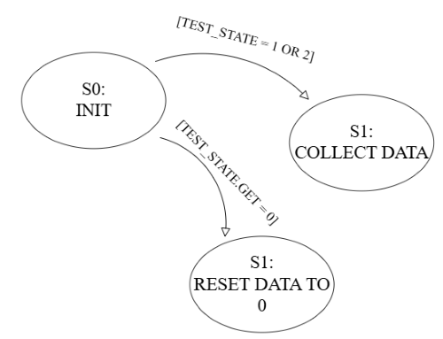

### *imu_task*  

The IMU task acts in a similar way to the encoder task, but it collects our heading position instead.  
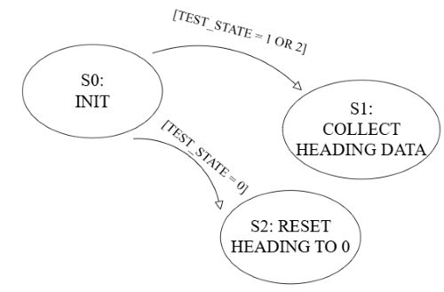

### *monitor_task*  

 The monitor tasks measures the initial heading at the starting line. This initial heading value is then compared to the heading value right before the grid, which should be at about 180 degrees. This allows us to switch our Romi into test state 2 and thus turn on grid mode.  
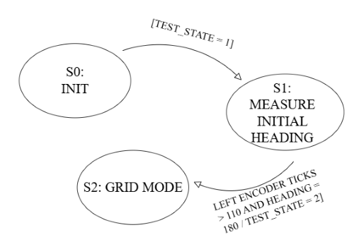

### *grid_task*  

In the grid task, Romi is designed to go straight as long as the grid duration time is greater than the elapsed time. However, once the grid duration was less than the elapsed time, Romi would then stop moving as preparation to pivot at the end of the grid into Checkpoint 5.   
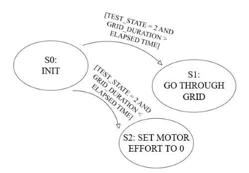
## **Explanations of each py file**
### *motor py*
The *motor.py* file defines a class for running the Romi motors and setting the duty cycle for each motor. It enables the motors to spin according to the specified duty cycle.
### *Encoder py*
The *encoder.py* file contains the class to read the encoder of both the left and right wheel. It contains methods to update the encoders and returns the position and delta values, which can be used to determine the velocity of each wheel. The end of the class also contains a method to zero Romi's position. 
### *cotask py*
The *cotask.py* file contains the class and the methods to run the scheduler, which runs the tasks based on the specified period and priority of each task specified by the user that were described in the [State Transition Diagram](#state-transition-diagram) portion previously mentioned. These periods and priorities are also set by the user in the [main py](#main-py) file.
### *task_share py*
The *task_share.py* file depicts a class that allows share and queue variables to be created. This allows data to be shared between share the wheels and user control tasks.
### *linesensor py*
The *linesensor.py* file allows us to calibrate our IR sensors to differentiate between white and black colors. It also computes an error based off our PID values that were determined by the user and the differentiation from the centroid. This error allows for motor speed for each wheel to be corrected in order to keep Romi on a line. 
### *main py*
The *main.py* file is where all of the previously mentioned files are able to come together and communicate to one another. The user is also able to set Romi's base motor speed and adjust proportional-integral-derivative (PID) gain values in order to optomize Romi's performance for the game track.   
## **Game Track and Results**
### **Game Track and Strategy**

**Pre-Track Calibration**  
Prior to putting Romi on the track, we had to calibrate the IR sensors to make line following possible. This was done by placing Romi on any white portion of the track, letting Romi calibrate white for 3 seconds, putting Romi into the calibration corner on the bottom right corner of the track, and letting Romi calibrate black for another 3 seconds. Once calibrated, Romi was placed on the starting line where our initial heading value is taken (this is important for the grid portion part of the game track). Romi then starts once the user presses "1" on their laptop. 

**Beginning: Start-Diamond**  
The game track heavily relies on IR sensors for navigation along most of the path, utilizing a proportional only control system to keep Romi on course. To initiate movement, we implemented line following using the IR sensors with a **Kp value of 4.5**. However, just before reaching the diamond path, we transitioned Romi out of line-following mode by hardcoding a specific range of values for our **left encoder ticks, which was in a range of 30-37**. In this new mode, Romi is manually programmed to move forward at 20% effort to both wheels for 2.25 seconds, ensuring precise navigation through the designated section.

**Path Following: Checkpoints 1-4**  
Once Checkpoint 1 is hit, Romi then goes back to line sensing mode until the grid portion at Checkpoint 4, again with a **Kp value of 4.5**. During this stretch between checkpoints 1-4, we found our robot to be very smooth with its line following capabilities. 

**Grid Portion: Checkpoints 4-5**  
At Checkpoint 4, we transitioned from line following to a grid-based navigation task, utilizing the IMU to maintain a straight heading, precisely 180 degrees from our starting position. At this point, we employed a similar approach to the diamond path, programming Romi to move forward based on a specific **left encoder reading (110 counts), a set effort of 20%, and a duration of 2.5 seconds.**  

However, this marked the last successful checkpoint we achieved. We encountered an issue preventing Romi from switching into Test State 2, which was required to enable the grid-following task. As a result, Romi was unable to execute the necessary pivot at the end of the grid at Checkpoint 5.

**Last Stretch: Checkpoint 5-Finish**  
As mentioned earlier, we were unable to progress past the grid portion. Consequently, everything outlined below details our intended plan for guiding Romi to the finish line.  

After pivoting at Checkpoint 5, Romi would re-engage its IR sensor task to resume line following until its bump sensors detect contact with the wall. At this point, Romi would execute a 90-degree clockwise pivot using the IMU heading. Encoder ticks would then be used to drive forward until making contact with the 5-second time deduction cup, followed by a 90-degree counterclockwise pivot via the IMU. From there, encoder ticks would again be used to move straight until an IR sensor detects a black line. At this detection point, Romi would perform another 90-degree counterclockwise pivot using the IMU heading before relying on IR sensors once more to navigate to the finish line.

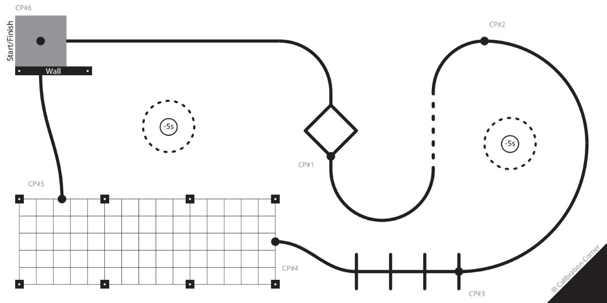

### **Results**
A video depicting our personal best run is shown [here](https://www.youtube.com/watch?v=51YOCL-ghLs). While this run was ultimately short of the finishline, it was the most success run we had, arriving to an end right before Checkpoint 5 at the end of the grid. Meanwhile, during lab, we presented three trials in front of our class to demonstrate our Romi's capabilities of being able to complete the game path. However, as shown in the following table, we were unable to complete any trial successfully.  

|Trial|Checkpoint 1|Checkpoint 2|Checkpoint 3|Checkpoint 4|Checkpoint 5|Total Time|Cups Hit|  
|-----|------------|------------|------------|------------|------------|----------|--------|
|1|5.81|N/A|N/A|N/A|N/A|N/A|0|
|2|6.03|11.11|16.63|19.68|N/A|N/A|0|
|3|N/A|N/A|N/A|N/A|N/A|N/A|0|
|PB*|5.39|10.17|14.84|17.89|N/A|N/A|0|    

*Personal Best  

### **Recap**  
While we were unable to complete the course, we were glad to have made the amount of progress that we ended up making. During our trial runs, Romi was inconsistent in terms of which checkpoint it would end at, which was not an issue the night before where we consistenly ended right before Checkpoint 5 at the end of the grid. Throughout this project we grew quick to learn how impactful battery voltage played in terms of the performance of our Romi. We discovered that different battery voltages required different PID values for our feedback control in our line sensor, which was very frustrating during testing. To combat this, a voltage divider could have been made, but we ultimately decided to not go with that route due to the time crunch we had. Additionally, we also did not implement Bluetooth with our Romi due to the time crunch. Nonethless, despite its ups and downs, this project was fun and it was a great experience seeing how quick other student groups were able to get their Romis to follow the gametrack successfully. 

